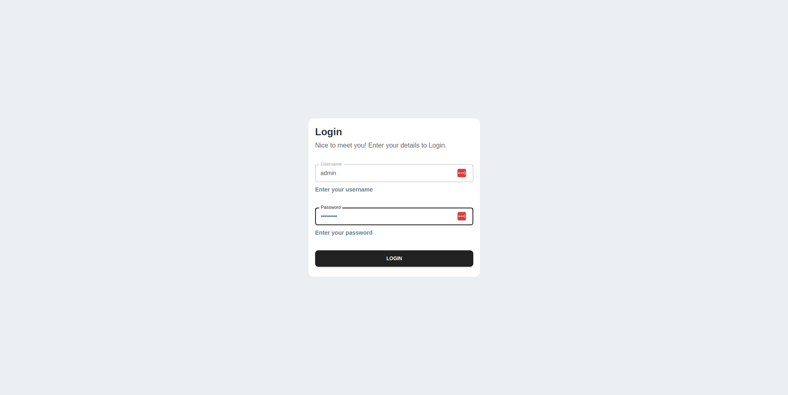
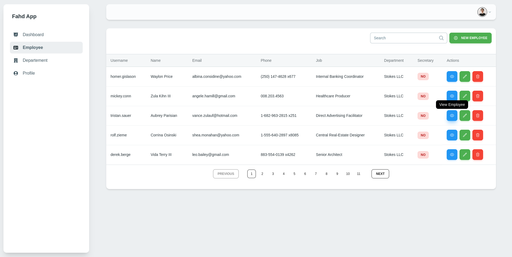
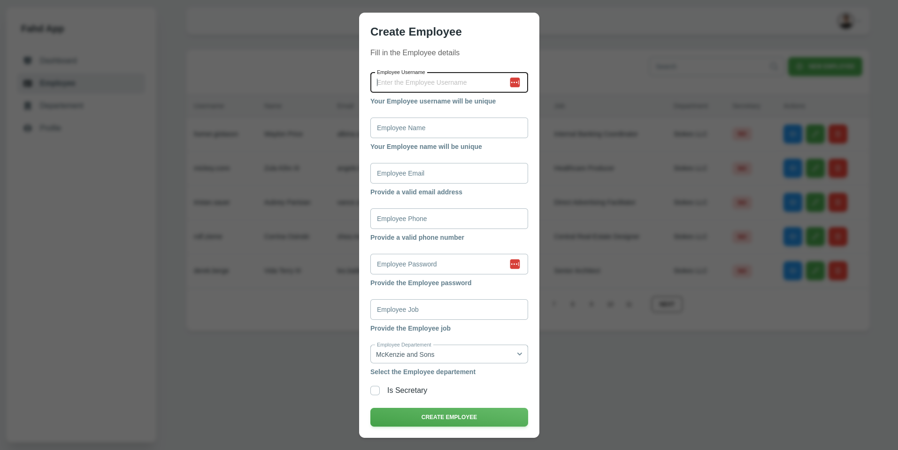
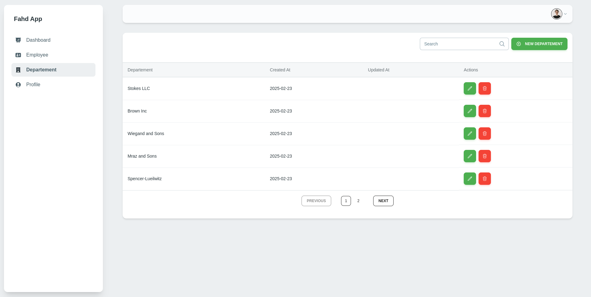
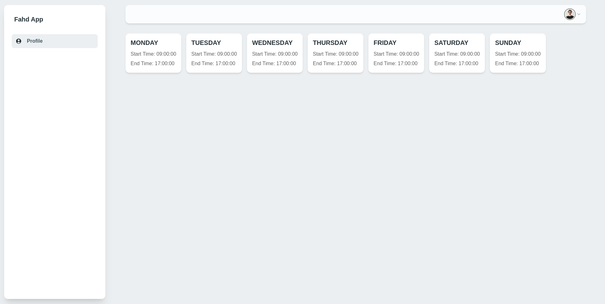

# OCP Planning

## 📋 Table of Contents
- [📖 Project Overview](#-project-overview)  
- [🚀 Quick Start](#-quick-start)  
- [🔧 Requirements](#-requirements)  
- [📂 Project Structure](#-project-structure)  
- [🛠️ Development Setup](#-development-setup)  
- [📝 API Documentation](#-api-documentation)  
- [🌍 Deployment](#-deployment)  
- [📸 Demo](#-demo)  
- [🔐 License](#-license)  
- [📞 Contact](#-contact)  

---

## 📖 Project Overview

OCP Planning is a web-based application designed to simplify employee and department management. It offers key features such as employee record handling, departmental assignments, and role-based access control. The frontend is built using **Next.js**, while the backend leverages **Spring Boot**.

The entire application is containerized with **Docker**, ensuring scalability in production environments with the help of **Docker Swarm**.


---

## 🚀 Quick Start

Follow these steps to quickly set up the project:

1. **Clone the repository**:
   ```bash
   git clone https://github.com/marouanedbibih/ocp-planning.git
   cd ocp-planning
   ```

2. **Docker Setup**:
    - Navigate to the `docker/` folder and run the script:
      ```bash
      bash dev.sh
      ```
    - For more details on using Docker with this project, refer to `docker.md`.

3. **Backend Setup**:
   - Go to the `backend/` directory and install the required dependencies:
     ```bash
     ./mvnw install
     ```
   - To start the backend service:
     ```bash
     ./mvnw spring-boot:run
     ```

4. **Frontend Setup**:
   - Navigate to `frontend/` and install dependencies:
     ```bash
     npm install
     ```
   - To start the frontend:
     ```bash
     npm run dev
     ```

5. **Access the application**:
   - Frontend: [http://localhost:3000](http://localhost:3000)
   - API: [http://localhost:8082](http://localhost:8082)

---

## 🔧 Requirements

Ensure the following dependencies are installed to run the project:

| Dependency           | Description                                  |
|----------------------|----------------------------------------------|
| **Node.js**          | Required for the frontend. Download from [Node.js website](https://nodejs.org). |
| **Java 21**          | Required for the backend. Download from [OpenJDK website](https://openjdk.java.net/). |
| **Docker & Docker Compose** | Required for containerization. Install from [Docker website](https://www.docker.com/get-started). |

---

## 📂 Project Structure

```
ocp-planning/
├── backend/            # Spring Boot backend service
│   ├── src/            # Application source code
│   ├── pom.xml         # Maven configurations
│
├── frontend/           # Next.js frontend service
│   ├── src/            # Frontend source code
│   ├── package.json    # Node.js dependencies
│
├── docker/             # Docker configurations
│   ├── compose.yml     # Base Docker Compose file
│   ├── Dockerfile.backend  # Backend Dockerfile
│   ├── Dockerfile.frontend # Frontend Dockerfile
│
├── docs/               # Documentation files
│   ├── backend.md      # Backend-related documentation
│   ├── frontend.md     # Frontend-related documentation
│   ├── docker.md       # Docker-related documentation
│
├── LICENSE             # License file
├── README.md           # This README file
```

---

## 📝 API Documentation

The backend exposes a **REST API**. Access the API documentation through the following:

- **Swagger UI**: [http://localhost:8080/swagger-ui.html](http://localhost:8080/swagger-ui.html)

---

## 🌍 Deployment

To deploy the application in production, use the following steps:

1. Build and deploy using Docker Compose:
   ```bash
   docker compose -f docker/compose.yml -f docker/compose.prod.yml up --build -d
   ```

2. Deploy to **Docker Swarm**:
   ```bash
   docker stack deploy -c docker/compose.yml -c docker/compose.prod.yml ocp-planning
   ```

---

## 📸 Demo

You can explore the application through the following links:

- **Frontend**: [http://ocp-planning.marouanedbibih.engineer](http://ocp-planning.marouanedbibih.engineer)
- **Backend API**: [http://api.ocp-planning.marouanedbibih.engineer](http://api.ocp-planning.marouanedbibih.engineer)

Check out the application's features through these snapshots:

1. **Login Page**  
   The login page for user authentication.  
   [](http://ocp-planning.com/login)

2. **Employee Management**  
   View and manage employee records.  
   [](http://ocp-planning.com/employees)

3. **Employee Form**  
   Add or edit employee details.  
   [](http://ocp-planning.com/employee-form)

4. **Department Management**  
   Overview of department management.  
   [](http://ocp-planning.com/departments)

5. **Planning View**  
   View for managing departmental assignments.  
   [](http://ocp-planning.com/planning)

---

## 🔐 License

This project is licensed under the [MIT License](LICENSE).

---

## 📞 Contact

For inquiries, contact:

📧 **Marouane Dbibih** – [m.dbibih@gmail.com](mailto:m.dbibih@gmail.com)

---

Let me know if you need any further adjustments!